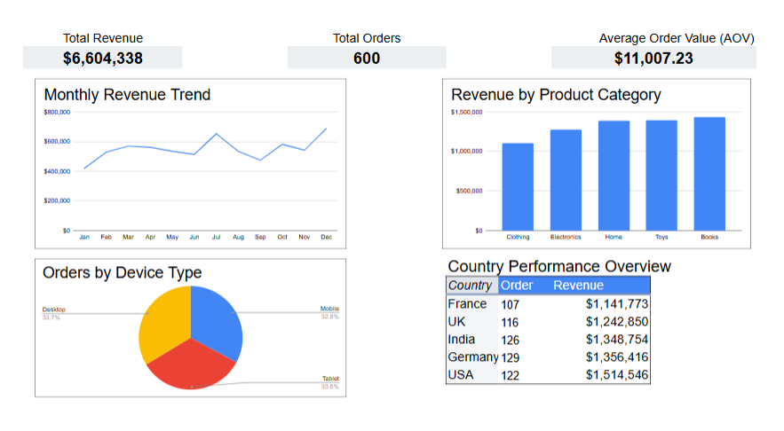

# E-commerce Sales Performance Analysis

## Project Overview

This project focuses on analyzing e-commerce sales data to evaluate business performance, identify revenue drivers, and uncover actionable insights.

The analysis includes data cleaning, exploratory data analysis (EDA), SQL-based business metrics calculation, and dashboard development.

The goal was to transform raw transactional data into meaningful business insights that support data-driven decision-making.

---

## Business Problem

E-commerce businesses need to understand which products, markets, and customer segments contribute most to revenue. They also need visibility into sales trends and operational performance.

This project aims to answer the following business questions:

- How does revenue change over time?
- Which product categories generate the most revenue?
- Which countries are the most valuable markets?
- What is the average order value?
- How are orders distributed across devices?
- What does delivery performance look like?

---

## Dataset

The dataset contains transactional information from an online store.

| Column | Description |
|----------|-------------|
| order_id | Unique order identifier |
| user_id | Customer identifier |
| order_date | Order date |
| product_id | Product identifier |
| category | Product category |
| price | Product price |
| quantity | Quantity purchased |
| discount | Applied discount |
| payment_method | Payment method |
| delivery_status | Delivery status |
| country | Customer country |
| device | Device type |
| total | Total order value |

---

## Process

### 1. Data Cleaning

- Checked for missing values
- Identified duplicate records
- Validated data formats and data types
- Prepared the dataset for analysis

### 2. Exploratory Data Analysis (EDA)

Explored:

- Revenue distribution by product category
- Monthly sales trends
- Geographic distribution of sales
- Device usage patterns

### 3. SQL Analysis

SQL queries were written in BigQuery to calculate key business metrics:

- Monthly Revenue Trend
- Average Order Value (AOV)
- Revenue by Category
- Revenue by Country
- Delivery Status Analysis

### 4. Dashboard Development

Built an interactive dashboard in Google Sheets to visualize KPIs and support business decision-making.

---

## Key Metrics

| Metric | Value |
|----------|----------|
| Total Revenue | $6.6M |
| Total Orders | 600 |
| Average Order Value (AOV) | $11,007 |

---

## Key Findings

- Total revenue reached approximately **$6.6M**.
- Sales showed seasonal fluctuations with a peak at the end of the year.
- **Books** was the top-performing category by revenue.
- The **USA** generated the highest revenue among all markets.
- Revenue distribution across categories was relatively balanced.
- Orders were distributed almost evenly across Mobile, Desktop, and Tablet devices.
- The high AOV may indicate large order volumes or characteristics specific to the educational dataset.

---

## Dashboard Preview

**Interactive Version:**  
[View Google Sheets Dashboard](https://docs.google.com/spreadsheets/d/1oPjqZkJqP0049X0zswda4GMAv8w_3GFXXflEqJ4R7oE/edit?usp=sharing)

---

## Skills

- SQL (BigQuery)
- Google Sheets
- Data Cleaning
- Exploratory Data Analysis (EDA)
- Data Visualization

---

## Project Outcome

This project demonstrates the complete analytics workflow, including data preparation, exploratory analysis, SQL querying, dashboard creation, and business insight generation.

It highlights practical skills in data analysis and the ability to translate data into actionable recommendations.
